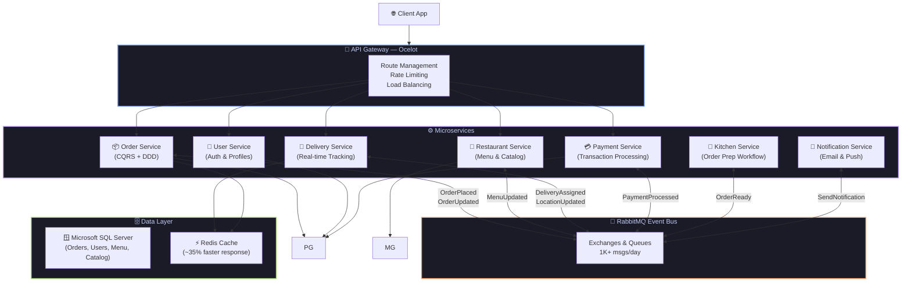
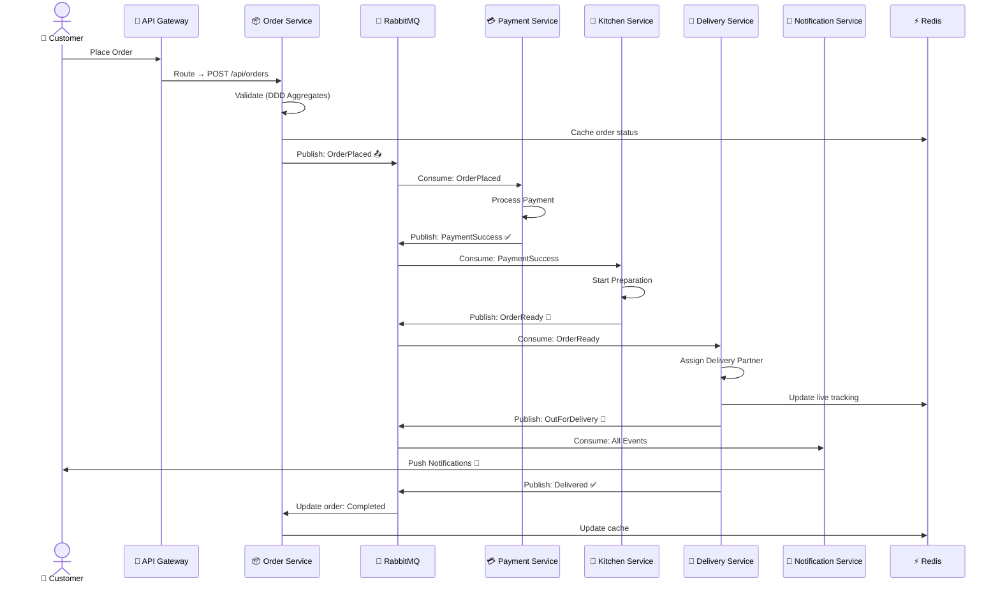
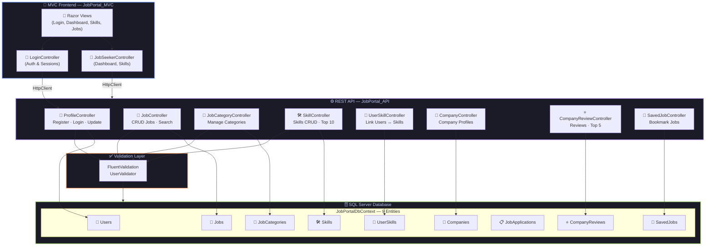
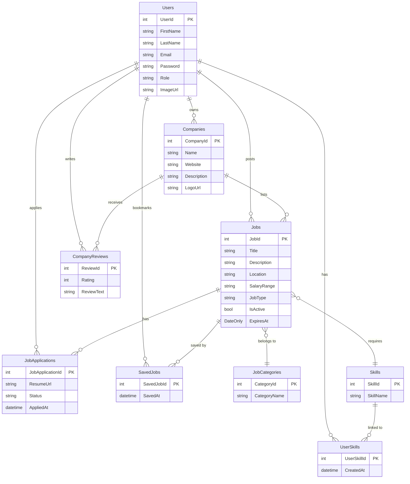
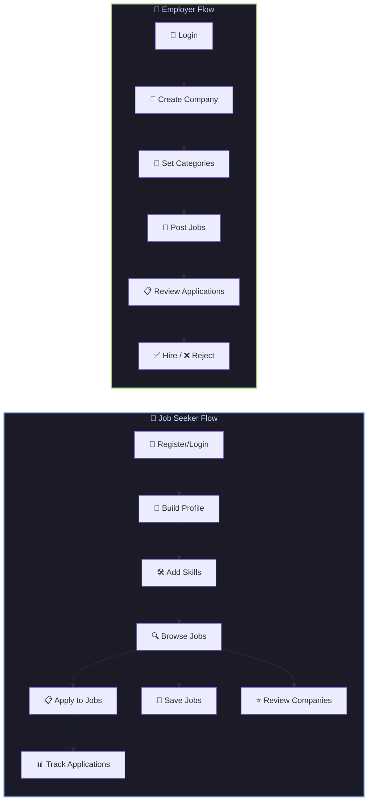

<!-- ========== HEADER SECTION ========== -->
<div align="center">
  
  <!-- Animated Wave Banner -->
  

  <!-- Animated Typing -->
  
  
  <p align="center">
    <i>Designing scalable backends, event-driven systems, and robust APIs.</i>
  </p>

  <p align="center">
    <a href="https://www.linkedin.com/in/shivam-valand/"></a>&nbsp;
    <a href="mailto:shivamvaland21@gmail.com"></a>
  </p>

  <!-- Animated Divider -->
  
</div>

<!-- ========== ABOUT ME - INTERACTIVE TERMINAL ========== -->

##  Who Am I?

<div align="center">
<table>
<tr>
<td width="55%" valign="top">

```csharp
// 💻 Shivam.cs — Loading Developer Profile...

public class Shivam : ISoftwareEngineer
{
    public string Name => "Shivam Valand";
    public string Education => "B.Tech CSE @ Darshan University";
    public string Role => ".NET Software Engineer";

    public string[] Superpowers => new[]
    {
        "ASP.NET Core", "Microservices",
        "Domain-Driven Design", "RabbitMQ",
        "Docker", "Clean Architecture"
    };

    public string[] CurrentlyLearning => new[]
    {
        "System Design", "AWS Cloud",
        "Distributed Systems", "Kubernetes"
    };

    public string FunFact =>
        "I optimize queries in my sleep! 💤";

    public string Motto =>
        "Ship fast. Scale smart. Debug later. 🚀";
}
```

</td>
<td width="45%" align="center">


<br/><br/>

**⚡ Daily Stack:**


</td>
</tr>
</table>
</div>


<!-- ========== TECH STACK - COLLAPSIBLE SECTIONS ========== -->

##  Technical Arsenal

<details open>
<summary><b>💻 Languages</b></summary>
<br/>
<div align="center">


</div>
</details>

<details open>
<summary><b>⚙️ Backend, Databases & Architecture</b></summary>
<br/>
<div align="center">


</div>
</details>

<details open>
<summary><b>🎨 Frontend & UI</b></summary>
<br/>
<div align="center">


</div>
</details>

<details open>
<summary><b>🚀 DevOps, Cloud & Tools</b></summary>
<br/>
<div align="center">


</div>
</details>

<br/>


<!-- ========== FEATURED PROJECTS - INTERACTIVE SHOWCASE ========== -->

##  Featured Projects

<div align="center">

> 🏗️ *Building things that matter, one commit at a time.*

<br/>

<!-- Custom Project Cards using badge style -->
<a href="https://github.com/Shivam93294Valand/FoodDelivery-micoservices">
  
</a>

<br/><br/>

<a href="https://github.com/Shivam93294Valand/jobportal">
  
</a>

<br/><br/>

<a href="https://github.com/Shivam93294Valand/Quiz-Management-System">
  
</a>

</div>

<br/>

---

### 🍔 Food Delivery Microservices

<div align="center">

*A production-grade distributed system with 7+ independently deployable services*


<a href="https://github.com/Shivam93294Valand/FoodDelivery-micoservices">
  
</a>

</div>

<details open>
<summary><b>📐 System Architecture Diagram</b></summary>
<br/>



</details>

<details open>
<summary><b>🔄 Event-Driven Order Flow</b></summary>
<br/>



</details>

<details open>
<summary><b>📊 Key Highlights</b></summary>
<br/>

| Feature | Details |
|:--------|:--------|
| 🏗️ **Architecture** | Microservices with **Domain-Driven Design (DDD)** |
| 📨 **Messaging** | Event-driven with **RabbitMQ** — 1K+ messages/day |
| 🚪 **API Gateway** | Centralized routing & load balancing via **Ocelot** |
| ⚡ **Caching** | **Redis** → ~35% faster API response times |
| 🐳 **Containers** | Fully **Dockerized** with Docker Compose |
| 📦 **Pattern** | CQRS for read/write separation on Order Service |
| 🗄️ **Databases** | Polyglot persistence — **PostgreSQL** + **MongoDB** |

</details>

<br/>

---

### 💼 Job Portal

<div align="center">

*A full-stack job platform with 9 database entities, 8 API controllers, and role-based MVC frontend*


<a href="https://github.com/Shivam93294Valand/jobportal">
  
</a>

</div>

<details open>
<summary><b>📐 System Architecture Diagram</b></summary>
<br/>



</details>

<details open>
<summary><b>🗃️ Database Entity Relationship Diagram</b></summary>
<br/>



</details>

<details open>
<summary><b>🔄 User Journey Flow</b></summary>
<br/>



</details>

<details open>
<summary><b>📊 Key Highlights</b></summary>
<br/>

| Feature | Details |
|:--------|:--------|
| 🏗️ **Architecture** | **2-tier** — ASP.NET MVC frontend consuming .NET 8 Web API |
| 🗄️ **Database** | **SQL Server** with **EF Core 8** (DB-First scaffold) |
| 📊 **Entities** | **9 tables** — Users, Jobs, Companies, Skills, Applications, etc. |
| ⚙️ **API** | **8 RESTful controllers** with full CRUD + Swagger docs |
| ✅ **Validation** | **FluentValidation** for server-side input rules |
| 🔐 **Auth** | Login/Register with email + password, role-based access |
| 🔗 **Communication** | MVC → API via `HttpClient` with `IHttpClientFactory` |
| 📄 **Frontend** | Razor Views with controller routing (`Login → Dashboard → Skills`) |

</details>

<br/>

---

<div align="center">
  <a href="https://github.com/Shivam93294Valand?tab=repositories">
    
  </a>
</div>

<br/>


<!-- ========== GITHUB STATS - INTERACTIVE DASHBOARD ========== -->

##  GitHub Dashboard

<div align="center">

<!-- Streak Stats -->
<a href="https://github.com/Shivam93294Valand">
  
</a>

<br/><br/>

<!-- Profile Details -->
<a href="https://github.com/Shivam93294Valand">
  
</a>

<br/><br/>

<!-- Language Cards -->
<a href="https://github.com/Shivam93294Valand">
  
</a>
<a href="https://github.com/Shivam93294Valand">
  
</a>
<a href="https://github.com/Shivam93294Valand">
  
</a>

<br/><br/>

<!-- Contribution Graph -->
<a href="https://github.com/Shivam93294Valand">
  
</a>

</div>

<br/>


<!-- ========== DEV QUOTE ========== -->

## 💡 Random Dev Quote

<div align="center">
  
  
  <br/>
  
  > *"Any fool can write code that a computer can understand. Good programmers write code that humans can understand."* — **Martin Fowler**
</div>

<br/>


<!-- ========== LET'S CONNECT ========== -->

## 🤝 Let's Connect & Collaborate!

<div align="center">
  
<a href="[https://www.linkedin.com/in/shivam-valand-49a44a256/](https://www.linkedin.com/in/shivam-valand/)"></a>&nbsp;
<a href="mailto:shivamvaland21@gmail.com"></a>&nbsp;
<a href="https://github.com/Shivam93294Valand"></a>

</div>

<br/>

<!-- ========== FOOTER ========== -->

<div align="center">
  
  <!-- Profile Counters -->
  &nbsp;
  &nbsp;
  

  <br/>

  

  <br/>
  <!-- Waving Footer -->
  
</div>
